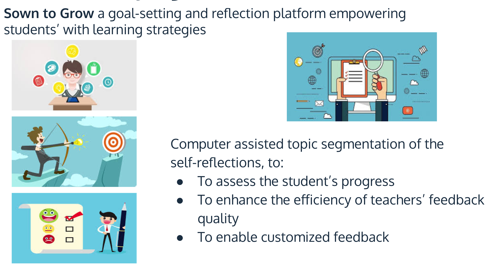

# Reflectometer

##  Overview
The prevalent use of online platforms for interaction and large size of the text data from users’ input makes digesting the data increasingly time consuming. Sown to Grow (www.sowntogrow.com/) is an online educational company with the aim to empower students by providing a platform to set goals and reflect on strategies and interact with their teachers. In order for this company to be able to scale up across the US, they need to automate parsing reflections to enable the customized the feedback with priority given to students that no strategy has been identified in their reflections. To read in more detail you can rad my blogpost https://medium.com/@shahrzad.hosseini/how-i-tackled-a-real-world-problem-with-guidedlda-55ee803a6f0d.

## What is Reflectometer?
Reflectometer is a natural language understanding project that extracts the learning strategies from unstructured text data through various topic modelling techniques. In this repo, I am trying to show my thought process in tackling a real world problem of topic modelling in very informal/conversational text data. 

## Where did the data come from?
The data in this project was the provided by the company (Sown to Grow) which I am consulting for. The dataset included about 180k of reflection document. The steps used for cleaning the data can be seen the corrsponding notebook in this repo with the name data cleaning.

## Strategies and Algorithms 
### Preprocessing notebook: 
incldues speclling correction and lower casing, removing punctuation, lemmatziang and tokenizing the text.
### Perliminary topic modelling notebook:
includes the prilimnary distribution of the keywords in each topic and the grid search showing the optimal number of the topics. As you will see lots of keywords are shared between the topics which makes identifying the topic for the bag of words impossible.
Feature engineering notebook:
is for extarcting the verbs and nouns from the text data and to use as feature for the next step.
### GuidedLDA notebook:
this is the main notebook that shows the applying GuidedLDA to data. Guided LDA is basically incorporating the lexial prior into topic model. More on GuidedLDA can be found here: https://www.aclweb.org/anthology/E12-1021/. Python implementation of the gudied LDA can be found here:https://www.aclweb.org/anthology/E12-1021/

## What did I find in the data?
Using GuidedLDA I could find 6 well-separated topics of learning startegies in students reflections. 

## Recommendations
Based on this work I recommended to the company to modify the platform so the number and amount of non relevant conent can be decreased. and use the suggested topics to find the volunerable students to allcoate the required resources and monitor the progress of the studnets across the platfrom.
This could reslut in scaling up the companies product across the US. 

